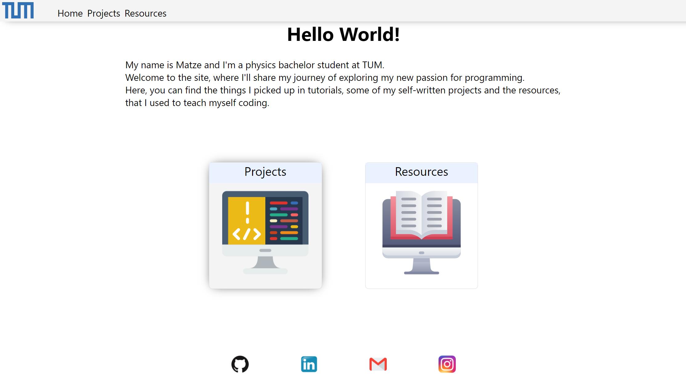

My name is Matze and I'm a physics bachelor student at TUM.
In this repository is the source code for a website (user.ph.tum.de/matthias.sagerer), where I'll share my journey of exploring my new passion for programming.
There, you can find the things I picked up in tutorials, some of my self-written projects and the resources, that I used to teach myself coding.

