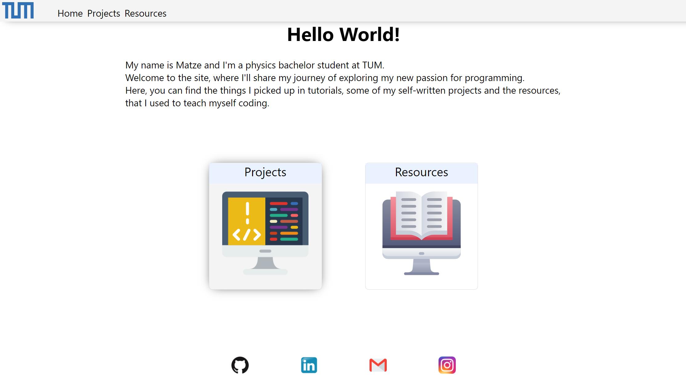
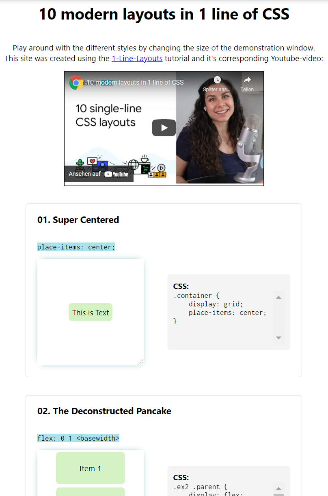

#### My personal TUM-Site
### https://users.ph.tum.de/matthias.sagerer

My name is Matze and I'm a physics bachelor student at TUM.
In this repository is the source code for a website, where I'll share my journey of exploring my new passion for programming.
There, you can find the things I picked up in tutorials, some of my self-written projects and the resources, that I used to teach myself coding.

# Some of my projects:
- Sudoku Application ([GitHub repository](https://github.com/MatthiasSagerer/Sudoku-Pygame))

- Calculator "BasicCalc" as a mobile application (see [GitHub repository](https://github.com/MatthiasSagerer/BasicCalculatorApp) and [Play Store entry](https://play.google.com/store/apps/details?id=com.matze.taschenrechner))